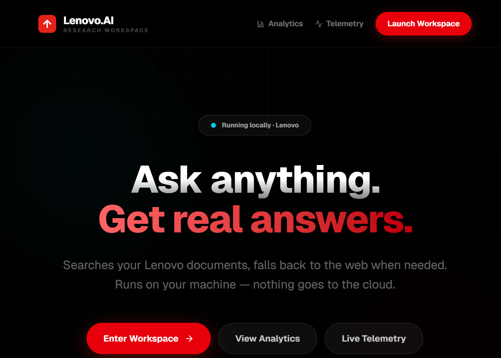
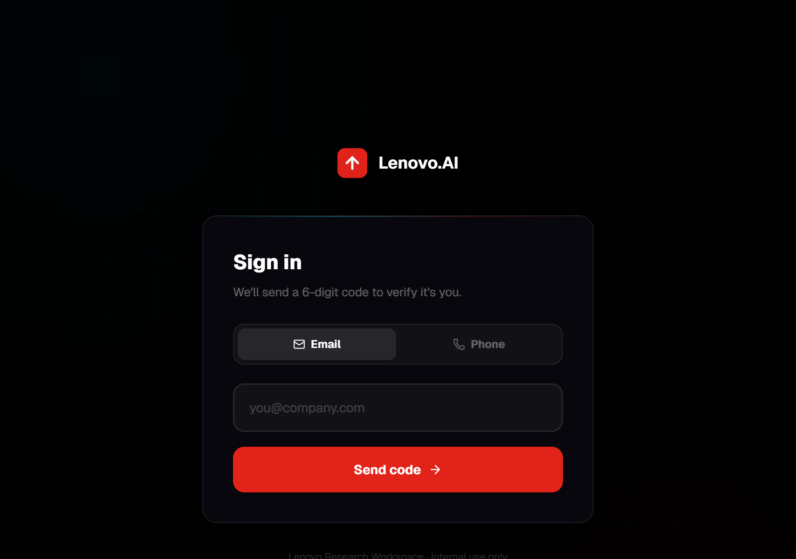
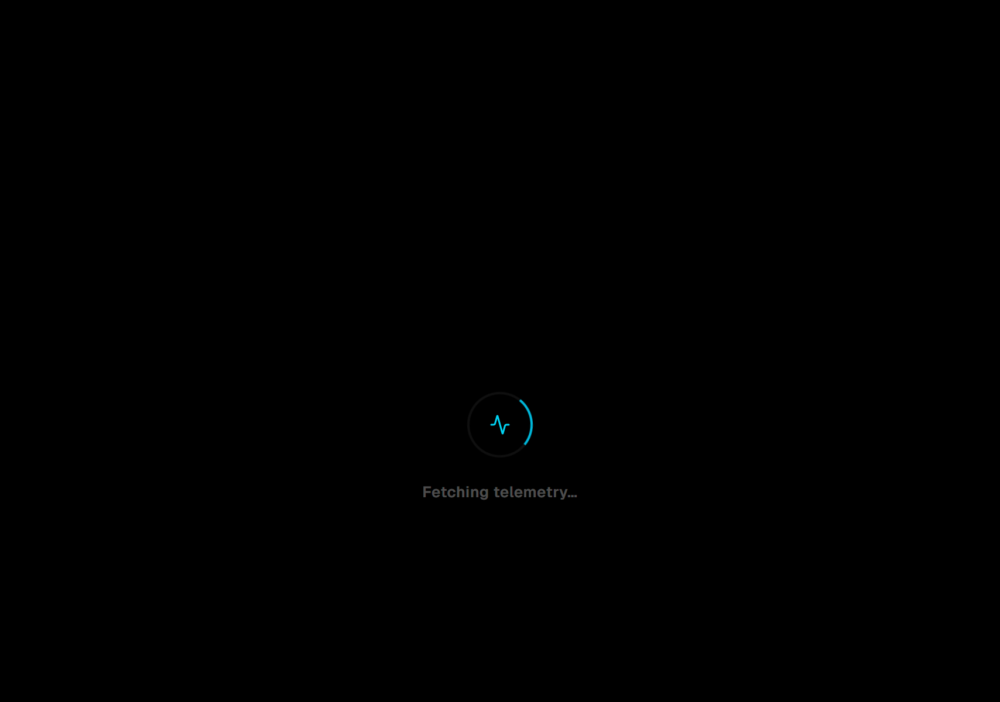
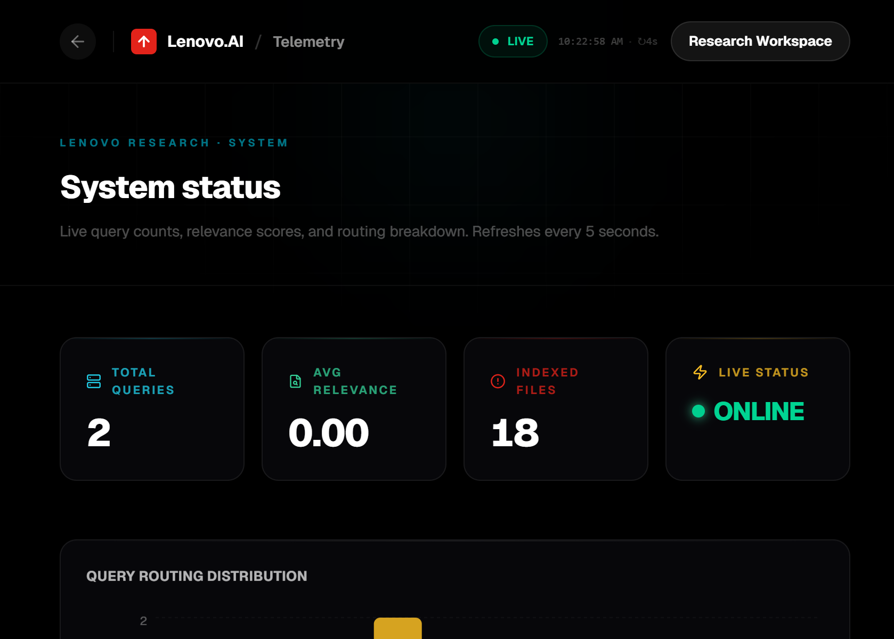

# Lenovo Research Workspace

A local document research workspace for enterprise use. Ask questions about your internal documents and get grounded answers with cited sources.

**Stack:**
- Frontend: Next.js 16 + React 18 + TypeScript
- Backend: FastAPI (Uvicorn)
- Inference: Ollama (Qwen 2.5 3B) — runs fully offline
- Search: ChromaDB with semantic embeddings
- Authentication: OTP (email or SMS)

## What it does

- **Semantic search** — searches your documents by meaning, not just keywords
- **Source grounding** — every answer cites the exact documents it used
- **Secure sign-in** — OTP authentication via email or phone
- **Analytics dashboard** — platform metrics and industry adoption data
- **System telemetry** — live query counts, relevance scores, routing breakdown
- **Web fallback** — searches the web automatically for queries outside your documents
- **Fully offline** — inference runs locally, nothing leaves your machine

## Screenshots

### Landing page


### Sign-in


### Analytics dashboard


### System telemetry


## Project structure

```
.
├── backend/              # FastAPI server and query routing
├── frontend/             # Next.js web app
├── documents/            # Documents to index and search
├── setup/                # Ingestion scripts
├── vector_db/            # Search index (generated)
├── archive/              # Old prototype code
├── tests/                # Saved response samples
└── .github/workflows/    # CI
```

## Prerequisites

1. Git
2. Python 3.10+
3. Node.js 20+ and npm
4. [Ollama](https://ollama.com)

## Setup

### 1. Clone

```bash
git clone https://github.com/Nikhile-P/RAG-AI-Framework.git
cd RAG-AI-Framework
```

### 2. Python environment

**Windows:**
```powershell
python -m venv venv
.\venv\Scripts\Activate.ps1
```

**macOS / Linux:**
```bash
python3 -m venv venv
source venv/bin/activate
```

### 3. Install backend dependencies

```bash
pip install -r backend/requirements.txt
pip install python-dotenv langchain-community langchain-text-splitters langchain-huggingface langchain-core langchain-chroma langchain-ollama langgraph langchain-tavily sentence-transformers pypdf python-docx openpyxl
```

### 4. Install frontend dependencies

```bash
cd frontend
npm install
cd ..
```

### 5. Download the model

```bash
ollama pull qwen2.5:3b
```

Make sure Ollama is running before the next steps.

### 6. Environment variables (optional)

Create a `.env` file at the project root:

```env
# Enable web search for queries not covered by your documents
TAVILY_API_KEY=tvly-xxxxxxxxxxxxxxxxxxxxxxxxxxxxxxxx

# Model and retrieval settings
LOCAL_MODEL_NAME=qwen2.5:3b
ENABLE_WEB_FALLBACK=true
RETRIEVER_K=5
RELEVANCE_THRESHOLD=0.68

# OTP email delivery (leave blank to use dev mode — code shown on screen)
GMAIL_USER=your@gmail.com
GMAIL_APP_PASSWORD=xxxx-xxxx-xxxx-xxxx
```

### 7. Index your documents

Drop your files (`.txt`, `.md`, `.pdf`, `.docx`, `.xlsx`, `.csv`, `.json`) into `documents/` then run:

```bash
python setup/ingest.py
```

This reads the files and builds the search index.

### 8. Start the servers

**Terminal 1 — Backend:**
```bash
cd backend
uvicorn main:app --reload --port 8000
```

**Terminal 2 — Frontend:**
```bash
cd frontend
npm run dev
```

Open **http://localhost:3000** in your browser.

---

## Privacy

By default, no document data or embeddings leave your machine. Keep API keys in `.env` — the `.gitignore` prevents them from being committed.

---

## License

MIT — see `LICENSE` for details. PRs and issues welcome.
